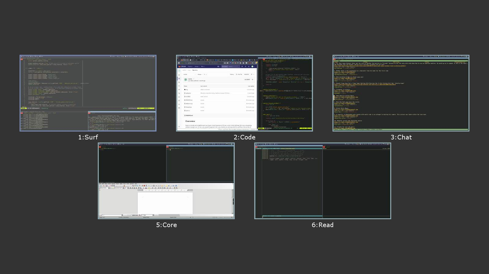

# i3expo

[](https://codecov.io/gh/laur89/i3expo)
[](https://github.com/laur89/i3expo/actions/workflows/main.yml)

## Overwiew

Expo is an simple and straightforward way to get a visual impression of all your
current virtual desktops that many compositing window managers use. It's not a very
powerful approach, but a very intuitive one and especially fits workflows that use
lots of temporary windows or those in which the workspaces are mentally arranged in
a grid.

i3expo emulates that function within the limitations of a non-compositing window
manager. By listening to the IPC, it takes a screenshot whenever a window event
occurs. Thanks to a fast C library, this produces negligible overhead in normal
operation and allows the script to remember what state you left a workspace in.

The script is run as a background process and reacts to signals in order to open its
UI in which you get an overview of the known state of your workspaces and can select
another with the mouse or keyboard.

Example output:



## Install it from PyPI

```bash
pip install i3expo
```

## Usage

Compile the `prtscn.c` following instructions in the file, or use the included
pre-compiled `i3expo/prtscn.so`

Note the `prtscn.so` needs to be in the same directory as the Python script, ie
in `i3expo/` subdir.

Default configuration is written into `$XDG_CONFIG_DIR/i3expo/config`. Color values
can be specified by using their PyGame names or in #fff or #ffffff hex.

Run `i3expod.py`, preferably in a terminal in order to catch any errors in this
pre-alpha state.

Send `SIGUSR1` to `i3expod.py` to show the Expo UI, for example by adding a `bindsym`
for `killall -s SIGUSR1 i3expod.py` to your i3 config. Send `SIGHUP` to have the
application reload its configuration.

Navigate the UI with the mouse or with they keyboard using `hjkl`, the arrow keys,
Return and Escape.

Recommended i3 config:

```
  exec_always --no-startup-id i3expod.py
  for_window [class="^i3expod\.py$"] fullscreen enable
  bindsym $mod1+e exec --no-startup-id killall -s SIGUSR1 i3expod.py
```

## Limitations

Since it works by taking screenshots, the application cannot know workspaces it
hasn't seen yet. Furthermore, the updates are less continuous than you might be used
to if you're coming from a compositing WM where they can happen live and in the
background.

## Caution

This is pre-alpha software and some bugs are still around. It works for my own,
single monitor and a common workflow. There is not much input validation and no
protection against you screwing up the layout or worse.

## Bugs

Stalled windows whose content i3 doesn't know cause interface bugs and could
probably be handled better, but this needs more testing.

Daemon's cpu usage raises considerably upon first time UI gets rendered. Believe this
has something to do with pygame not de-initing itself properly. *Confirm this is still
the case*

## Todo

- It's theoretically feasible to take the window information from i3's tree and allow
for dragging of windows from one workspace to another or even from container to
container. However, this would be massively complex (especially on the UI side) and
it's not clear if it would be worth the effort.
- ~~multimonitor support~~
- pause screenshotting while screen is locked, eg via i3lock

## Credit

- original code from https://gitlab.com/d.reis/i3expo
- Stackoverflow user JHolta for the screenshot library to be found in this thread:
https://stackoverflow.com/questions/69645/take-a-screenshot-via-a-python-script-linux
